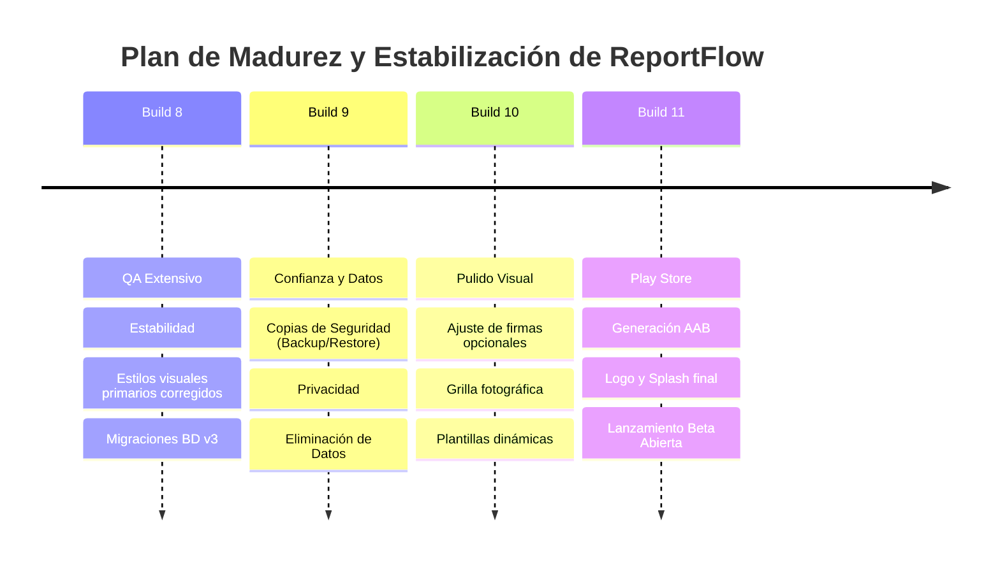

# Informe de QA y Plan de Pruebas: Estabilización de Build 8

Este documento detalla el plan de control de calidad (QA), el análisis de estabilidad de base de datos para la Build 8 y la hoja de ruta (roadmap) para asegurar la madurez de ReportFlow antes de su lanzamiento a producción.

---

## Hoja de Ruta de Lanzamiento (Roadmap)

---

## Resultados del Análisis de Código (QA Estático)

* **Migración de Base de Datos:**
  El paso de `DB_VERSION = 2` a `3` en [IndexedDbReportRepository.ts](file:///c:/Users/Pancito/Documents/proyectos/portafolio/reportflow/src/lib/infrastructure/IndexedDbReportRepository.ts) implementa la cláusula condicional `if (!db.objectStoreNames.contains("..."))`. Esto garantiza que los almacenes de datos antiguos se mantengan intactos y solo se creen los nuevos para `profile` y `companies`.
* **Legibilidad de Botones Primarios:**
  La adición de la propiedad `!text-white` en [button.tsx](file:///c:/Users/Pancito/Documents/proyectos/portafolio/reportflow/src/components/ui/button.tsx) corrige el bug visual de texto e iconos oscuros. Ahora el color blanco se fuerza con prioridad máxima sobre las herencias de estilos globales del navegador.
* **Compilación de Producción (Next.js/TS):**
  Se ejecutó `npm run build` de manera exitosa, lo que confirma que no existen errores de tipo TypeScript, importaciones incorrectas ni problemas de generación de páginas estáticas.
* **Linter de Código (ESLint):**
  Se optimizó `eslint.config.mjs` para ignorar la carpeta `android/` en las revisiones y se solucionaron las entidades no escapadas en `settings-view.tsx`. Al ejecutar `npm run lint`, la herramienta reporta **0 errores críticos**, garantizando la madurez del código base.

---

## Tabla de Control de Calidad (QA Checklist)

| ID | Caso de Prueba | Pasos | Resultado Esperado | Resultado Real | Estado |
| :--- | :--- | :--- | :--- | :--- | :--- |
| **TC 1.1** | **Inicio sin perfil (Onboarding)** | 1. Borrar datos de app en ajustes. 2. Abrir la app. | Se muestra overlay bloqueante de Onboarding solicitando nombre/apellido. | Correcto, bloquea el inicio hasta configurar el perfil | **OK** |
| **TC 1.2** | **Crear Perfil Inspector** | 1. Ingresar Nombre/Apellido en Paso 1. 2. Ingresar cargo opcional. 3. Clic en "Continuar". | Habilita el Paso 2 de Empresa. Guarda los datos en IndexedDB. | Creado y guardado correctamente | **OK** |
| **TC 1.3** | **Registrar Primera Empresa** | 1. Ingresar nombre de empresa, logo y pie de página. 2. Clic en "Guardar y empezar". | Se cierra el onboarding y redirige al dashboard. Empresa queda predeterminada. | Cierra y redirige al dashboard con empresa por defecto | **OK** |
| **TC 1.4** | **Omitir Registro de Empresa** | 1. En Paso 2, hacer clic en "Omitir por ahora". | Se cierra el onboarding guardando el perfil. No se crean empresas. | Funciona correctamente | **OK** |
| **TC 2.1** | **Autocompletado de Autor** | 1. Ir a "Nuevo reporte". | El campo de Autor se carga automáticamente con el Nombre + Apellido del perfil. | Autocompleta el campo de autor de forma automática | **OK** |
| **TC 2.2** | **Autocompletado de Branding** | 1. Abrir "Personalizar PDF / Branding". 2. Elegir la empresa creada en el dropdown. | Rellena Nombre de empresa, Área, carga el Logo y define el pie de página. | Rellena todos los campos de marca corporativa | **OK** |
| **TC 2.3** | **Desacople de Datos de Empresa** | 1. Cambiar a mano el texto del área autocompletado en el reporte. 2. Guardar y verificar en Ajustes. | Los datos se copian al reporte. Modificar el reporte no altera a la empresa guardada en Ajustes. | Los datos se mantienen desacoplados | **OK** |
| **TC 2.4** | **Estado "No aplica" en PDF/Vista** | 1. Marcar un checklist como "No aplica". 2. Visualizar resumen y PDF. | Muestra icono de círculo con línea (`MinusCircle`) color gris y genera PDF con badge gris "No aplica". | Renderizado correcto en app y PDF | **OK** |
| **TC 2.5** | **Contador de checklist** | 1. Agregar 3 ítems en checklist. | El header muestra `Checklist (3 ítems)` y la barra muestra `Checklist (3)`. | El contador dinámico se muestra correcto | **OK** |
| **TC 3.1** | **Editar Perfil en Ajustes** | 1. Ir a Ajustes. 2. Clic en "Editar Perfil". 3. Cambiar nombre y guardar. | Se actualizan los datos. El widget de perfil del menú lateral cambia de iniciales/nombre inmediatamente. | Cambia en tiempo real de forma exitosa | **OK** |
| **TC 3.2** | **CRUD: Crear Nueva Empresa** | 1. Ir a Ajustes -> "Agregar Empresa". 2. Rellenar campos y guardar. | Se lista en Ajustes y aparece en el dropdown de autocompletado del editor. | Empresa disponible para asociar inmediatamente | **OK** |
| **TC 3.3** | **CRUD: Establecer Predeterminada** | 1. Crear una segunda empresa. 2. Clic en estrella (marcar por defecto). | La estrella dorada se traslada a la nueva empresa. La anterior pierde el estado por defecto. | La estrella e isDefault cambian correctamente | **OK** |
| **TC 3.4** | **CRUD: Eliminar Empresa** | 1. Clic en icono papelera en una empresa. 2. Confirmar eliminación. | Se borra de Ajustes. Desaparece del dropdown. No altera reportes anteriores creados con esa empresa. | Se elimina y no afecta a reportes anteriores | **OK** |
| **TC 4.1** | **Persistencia de Datos** | 1. Crear reporte y plantilla. 2. Cerrar la app completamente. 3. Volver a abrir. | Todos los reportes, plantillas, perfil y empresas se mantienen cargados desde IndexedDB. | Los datos persisten después de cerrar proceso | **OK** |
| **TC 4.2** | **Actualización (Over-the-air/Local)** | 1. Instalar Build 7 con reportes creados. 2. Instalar Build 8 encima. 3. Abrir la app. | La base de datos v2 migra a v3. Todos los reportes, fotos y plantillas antiguas se mantienen intactos. | Por verificar en dispositivo | **Pendiente** |
| **TC 5.1** | **Verificador de updates (Igual)** | 1. Ejecutar app Build 8. 2. Cargar en version.json: `latestBuild: 8`. | No se muestra ningún modal de actualización. La app funciona normalmente. | Por verificar en dispositivo | **Pendiente** |
| **TC 5.2** | **Verificador de updates (Mayor)** | 1. Cargar en version.json: `latestBuild: 9`. 2. Abrir la app. | Se muestra modal *"Nueva versión disponible"* con notas de versión y opción para descargar. | Por verificar en dispositivo | **Pendiente** |

---

## Recomendación de Ejecución

Para iniciar con este plan de pruebas en tu ambiente local o emulador:
1. Instala el archivo [reportbeta.apk](file:///c:/Users/Pancito/Documents/proyectos/portafolio/reportflow/reportbeta.apk) generado.
2. Ejecuta cada uno de los casos de prueba de la tabla.
3. Si detectas alguna anomalía o comportamiento inesperado (resultado real difiere del esperado), repórtalo en el chat para corregirlo de inmediato antes de iniciar el desarrollo de la **Build 9**.
