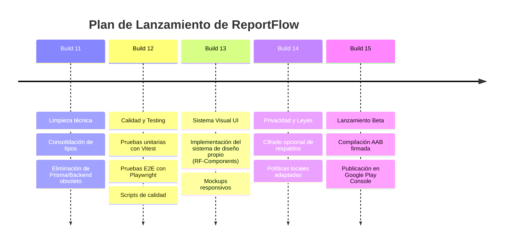

# Hoja de Ruta del Producto (Roadmap)

Este documento traza las fases de desarrollo planificadas para **ReportFlow** a partir de la estabilización técnica de la Build 11.

---

## Roadmap de Builds (11 a 15)

---

## Detalle de Próximas Builds

### Build 12: Pruebas Automáticas y Control de Regresión
* **Objetivo:** Evitar regresiones en componentes centrales mediante pruebas automatizadas.
* **Componentes Cubiertos:** Lógica de generación PDF, exportación/importación del BackupService, carga masiva, y clonado de reportes a plantillas.

### Build 13: Sistema de Diseño y Adaptabilidad UI
* **Objetivo:** Adoptar una interfaz de usuario cohesiva, responsiva y adaptable en tablets y teléfonos inteligentes.
* **Acciones:** Migración progresiva de las vistas del Dashboard y Editores a la gama de componentes `RFButton`, `RFCard`, `RFBottomSheet`, `RFStateSelect`, etc.

### Build 14: Cumplimiento Normativo y Seguridad
* **Objetivo:** Alineación con estándares de privacidad y seguridad de datos locales (Chile Ley 19.628 / OWASP MASVS).
* **Acciones:** Plan de respuesta a incidentes, mapa detallado del flujo de datos del usuario, y preparación para biometría y claves de cifrado.

### Build 15: Preparación Play Store y Beta Cerrada
* **Objetivo:** Empaquetado final y distribución a testers.
* **Acciones:** Configuración de assets oficiales de Google Play, firma de versión de lanzamiento en formato AAB, y canal de feedback de la beta.
