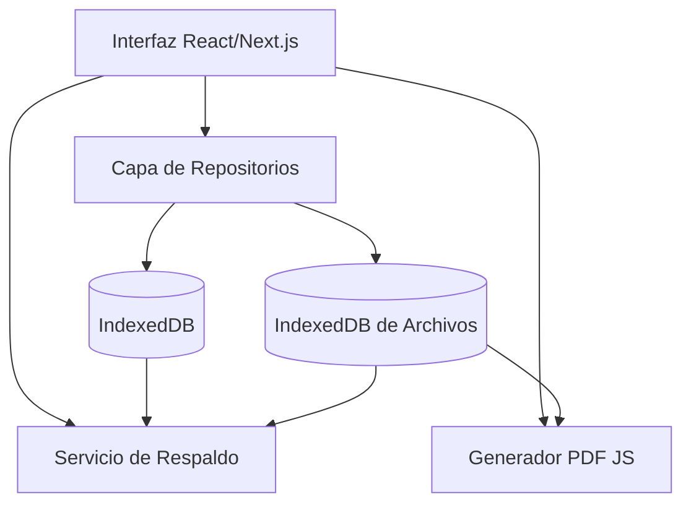

# Arquitectura Técnica de ReportFlow

Este documento describe la estructura y diseño técnico de **ReportFlow**, una aplicación de inspecciones y auditorías orientada a ser offline-first y local-first.

---

## 1. Diseño General (Local-First & Hybrid)

ReportFlow está construida bajo un paradigma **local-first**, lo que significa que el dispositivo del usuario es la única fuente de verdad y no requiere servidores o APIs externas para operar en terreno.

### Componentes de la Arquitectura:
1. **Next.js Static Export:** La aplicación está configurada para compilarse como una Single Page Application (SPA) estática pura. Se exporta al directorio `out/`.
2. **Capacitor.js Wrapper:** Capacitor toma el compilado estático de Next.js e inyecta un WebView nativo de alto rendimiento que corre localmente en dispositivos Android.
3. **Capa de Infraestructura Local:** Los repositorios de datos interactúan directamente con IndexedDB para lectura y escritura sin bloqueos de red.

---

## 2. Flujo de Datos e Interacción de Componentes

### Creación y Edición de Reportes:
1. El usuario edita un formulario React.
2. Los datos se validan en el cliente usando esquemas de validación basados en Zod.
3. Se persisten inmediatamente en IndexedDB.
4. Las imágenes capturadas con la cámara se leen como `Blob`/`Uint8Array` y se almacenan directamente en una IndexedDB dedicada a archivos binarios (`reportflow-files-db`), evitando problemas de rutas del sistema operativo móvil.

### Generación de Reportes PDF:
* A diferencia de sistemas tradicionales en la nube, la generación se ejecuta 100% en el procesador local del móvil utilizando la librería `pdf-lib`. Esto reduce el tiempo de espera a menos de 2 segundos y elimina costos de transferencia de red.
